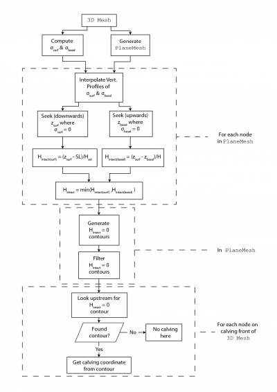
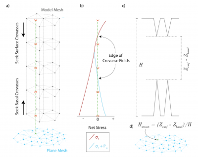

# Calving2D
This page describes the solver Calving2D which is the main component of Elmer/Ice's [2D calving model](http://elmerfem.org/elmerice/wiki/doku.php?id=problems:calving).

# Calving3D
This page describes the solver Calving3D which computes crevasse depth and predicts calving events in the [3D calving model](http://elmerfem.org/elmerice/wiki/doku.php?id=problems:calving).

In addition to the main solver, Calving3D makes use of two auxiliary solvers which must be present in the SIF: Calving Isosurface, ProjectCalving.




```
Solver Options
Solver 19
  Equation = "3D Calving"
  Exec Solver = "After Timestep"
  Procedure = "ElmerIceSolvers" "Find_Calving3D"
  Solver Timing = Logical True

  Variable = String "Calving"
  Variable DOFs = 3

  Exported Variable 1 = -dofs 1 "CIndex"
  Exported Variable 1 DOFs = 1

  Calving Search Distance = Real 3000.0
  Calving Mesh Min LC = Real 30.0
  Calving Mesh Max LC = Real 100.0
  Calving Mesh LC Min Dist = Real 500.0
  Calving Mesh LC Max Dist = Real 1500.0

  Calving Append Name = String "$namerun"" !"
  Calving Move Mesh Dir = String "./results/"

  Project Calving Equation Name = String "CalvingProjection"
  Isosurface Equation Name = String "Calving Isosurface"
  Crevasse Penetration Threshold = Real 0.2 !this is the upper limit of average intact ice
  Minimum Calving Event Size = Real 1.0 !minimum front displacement length
  Pause Solvers Minimum Iceberg Volume = Real 1.0E6

  Linear System Solver = Iterative
  Linear System Iterative Method = BiCGStab
  Linear System Max Iterations  = 2000
  Linear System Preconditioning = ILU1
  Linear System Convergence Tolerance = 1.0e-9
  Linear System Abort Not Converged = False
End

Solver 11
  Equation = "CalvingProjection"
  Procedure = File "ElmerIceSolvers" "ProjectCalving"
  Exec Solver = "Never" !auxiliary solver called by Calving3D
  Solver Timing = Logical True

  Basal Crevasse Model = Logical True
  Surface Crevasse Model = Logical True

  Calving Stress Variable Name = String "Stress"
  Plane Permutation(3) = Integer 1 3 2
  Volume Permutation(3) = Integer 1 3 2
End

Solver 24
  Exec Solver = "Never" !auxiliary solver called by Calving3D
  Equation = "Calving Isosurface"
  Procedure = File "Isosurface" "IsosurfaceSolver"

  Isosurface Variable = String "ave_cindex"
  Isosurface Value = Real 0.0
End
```
