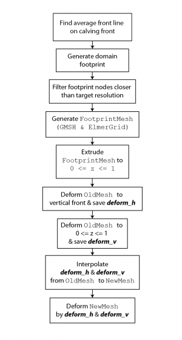

# Remesh
This page describes the solver Remesh which handles the domain remeshing which is required after large calving events in the [3D calving model](http://elmerfem.org/elmerice/wiki/doku.php?id=problems:calving).

In addition to the main solver, Remesh makes use of an auxiliary mesh update solver which must be present in the SIF.



## The Remeshing Algorithm

```
Solver Options
   TopMaskName = "Top Surface Mask"
   BotMaskName = "Bottom Surface Mask"
   LeftMaskName = "Left Sidewall Mask"
   RightMaskName = "Right Sidewall Mask"
   FrontMaskName = "Calving Front Mask"
   InMaskName = "Inflow Mask"

  Non-Vertical Face Name = String "Calving Front" <- just insist on this in the simulation
  Grounding Line Variable Name = String ... OPTIONAL, default GroundedMask
Solver 21
   Equation = "Remesh"
   Procedure = "ElmerIceSolvers" "Remesher"
   Exec Solver = "After Timestep"
   Solver Timing = Logical True
   Variable = "RemeshHeight"

   Non-Vertical Face Name = String "Calving Front"
   Mesh Update Helper Variable = String "Remesh Update"
   Remesh Vertical Stretch = Real 10000.0
   Vertical Front Computation = String "midrange"
   Metis Algorithm = Integer 1
   Pseudo SS dt = Real 1.0e-10 !timestep size after calving
   Force Remesh After Time = Real 0.1
   Front Normal Z Threshold = Real -0.8
   Pause After Calving Event = Logical True !pause, recompute stress, check for more calving

   Linear System Solver = Iterative
   Linear System Iterative Method = BiCGStab
   Linear System Max Iterations  = 2000
   Linear System Preconditioning = ILU1
   Linear System Convergence Tolerance = 1.0e-9
   Linear System Abort Not Converged = False

   Remesh Min Distance Threshold = Real 800.0 !Nodes closer have Min Char Len
   Remesh Max Distance Threshold = Real 20000.0 !Nodes further have Max Char Len
   Remesh Min Characteristic Length = Real 100.0 !Min Char Len
   Remesh Max Characteristic Length = Real 2000.0 !Max Char Len
   Remesh Default Characteristic Length = Real 2000.0 !Default (nodal) Char Len
   Remesh Remove Nodes Closer Than = Real 55.0
   Remesh Remove Nodes Deviation Threshold = Real 10.0

   Remesh Max Displacement Gradient = Real 5.0
   Remesh Displacement Deviation Limit = Real 50.0

   Tangled Variable Name = String "Tangled"

   Remesh Append Name = String "$namerun"" !"
   Remesh Move Mesh Dir = String "./results/"

   !We need to mess with these solvers if there's a calving event
   !because we pause time
   Mesh Update Variable 1 = String "Vertical Mesh Update"
   Mesh Update Variable 2 = String "Longitudinal Mesh Update"
   FreeSurface Variable 1 = String "Zs Top"
   FreeSurface Variable 2 = String "Zs Bottom"
   !Any time dependent solvers:
   Switch Off Equation 1 = String "Front Advance"

   !Exported Variable 1 = "FrontExtent"
End

Solver 22
  Equation = "Remesh Mesh Update"
  Procedure = File "MeshSolve2" "MeshSolver"
  Exec Solver = "Never" !auxiliary solver called by Remesh
  Solver Timing = Logical True

  Variable = Remesh Update
  Variable DOFs = 3
  Exported Variable 1 = RemeshTopSurf
  Exported Variable 2 = RemeshBottomSurf

  Linear System Solver = Iterative
  Linear System Iterative Method = BiCGStab
  Linear System Max Iterations  = 2000
  Linear System Preconditioning = ILU1
  Linear System Convergence Tolerance = 1.0e-12
  Linear System Abort Not Converged = False
  Nonlinear System Max Iterations = 3
  Nonlinear System Convergence Tolerance = 1.0e-06

  Compute Mesh Velocity = Logical False
  Ignore Displacement = Logical True
End
```

## CheckFlowConvergence
An additional solver “CheckFlowConvergence” is provided to allow the model to detect when remeshing has failed to produce a viable mesh for the computation of the flow solution. This solver, which should be called immediately after the flow solver, checks that the flow solution appears to be behaving by checking that:

The convergence flag of the flow solver is 'True'
The maximum computed velocity does not exceed “Maximum Velocity Magnitude”
The change in max velocity since previous timestep does not exceed a factor of “Maximum Flow Solution Divergence”
For the first time step, the solver keyword “First Time Max Expected Velocity” provides a value against which to test the “Maximum Flow Solution Divergence”.

If any of these 3 conditions are not met, CheckFlowConvergence recomputes the current timestep (by setting the timestep size extremely small), and attempts to improve the stability of the flow solution, firstly by temporarily switching off Newton Iterations, and secondly by slightly altering the remeshing arguments specified to the Remesh solver.

A list of time-dependent solvers should be provided to CheckFlowConvergence as shown in the example below.

```
Solver 5
  Equation = String "Check NS"
  Procedure = File "./bin/Remesh" "CheckFlowConvergence"

  Flow Solver Name = String "Flow Solution"
  Maximum Flow Solution Divergence = Real 1.3
  Maximum Velocity Magnitude = Real 1.0E6
  First Time Max Expected Velocity = Real 8.0E3

  Switch Off Equation 1 = String "StrainSolver"
  Switch Off Equation 2 = String "StressSolver"
  Switch Off Equation 3 = String "3D Calving"
  Switch Off Equation 4 = String "EigenSR"
  Switch Off Equation 5 = String "Free Surface Top"
  Switch Off Equation 6 = String "Free Surface Bottom"
  Switch Off Equation 7 = String "Front Advance"
  Switch Off Equation 8 = String "Longitudinal Mesh Update"
  Switch Off Equation 9 = String "Vertical Mesh Update"
  Switch Off Equation 10 = String "Homologous Temperature Equation"
  Switch Off Equation 11 = String "DeformationalHeat"
  Switch Off Equation 12 = String "Plume"
  Switch Off Equation 13 = String "Basal Melt"
End
```
